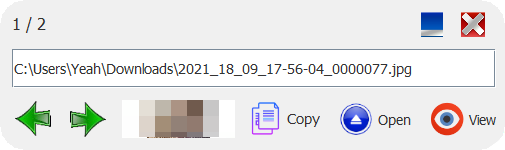

# InfoFileLib

## Small library to see the information of the images

- Use

~~~java

public static void main(String[] args) {

	LinkedList<String> test = new LinkedList();

	test.add("C:\\Users\\Yeah\\Downloads\\2021_18_09_17-56-04_0000077.jpg");

	test.add("C:\\Users\\Yeah\\Downloads\\2021_12_08_17-38-29_0000053.jpg");
	
	InfoFile prueba = new InfoFile(test);

	prueba.setColor(Color.blue); // Optional

	prueba.setVisible(true);

}

~~~